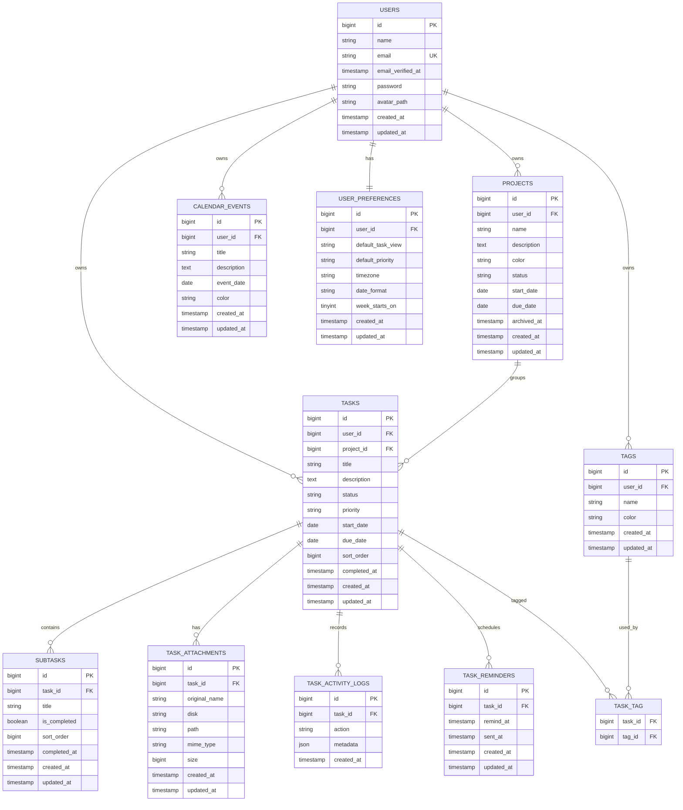

# ERD — TaskFlow

## 1. Database Principles

- Single-user product, but domain records still use `user_id`.
- This prevents accidental data leakage and keeps the schema extensible.
- Do not create role or permission tables.
- Use soft deletes only where recovery provides real value.
- Prefer explicit indexes for task-heavy filters.

---

## 2. ERD



---

## 3. Table Specifications

## `projects`

### Important columns

| Column | Type | Notes |
|---|---|---|
| id | bigint | PK |
| user_id | bigint | owner |
| name | varchar(120) | required |
| description | text nullable | optional |
| color | varchar(20) | hex/token |
| status | varchar(20) | active / archived |
| start_date | date nullable | |
| due_date | date nullable | |
| archived_at | timestamp nullable | |

### Indexes

```text
INDEX(user_id, status)
INDEX(user_id, due_date)
```

---

## `tasks`

### Important columns

| Column | Type | Notes |
|---|---|---|
| id | bigint | PK |
| user_id | bigint | owner |
| project_id | bigint nullable | nullable FK |
| title | varchar(200) | required |
| description | text nullable | |
| status | varchar(30) | todo / in_progress / review / done |
| priority | varchar(20) | low / medium / high |
| start_date | date nullable | |
| due_date | date nullable | |
| sort_order | bigint | manual order inside status |
| completed_at | timestamp nullable | set when status=done |

### Recommended indexes

```text
INDEX(user_id, status, sort_order)
INDEX(user_id, project_id)
INDEX(user_id, due_date)
INDEX(user_id, priority)
INDEX(user_id, completed_at)
INDEX(project_id, status)
```

Optional later:

```text
FULLTEXT(title, description)
```

Use only after validating MySQL version and search requirements.

---

## `calendar_events`

Calendar agendas are independent from tasks. They are owned by the authenticated
user and use a user-selected hex color for visual marking.

| Column | Type | Notes |
|---|---|---|
| id | bigint | PK |
| user_id | bigint | owner |
| title | varchar(200) | required |
| description | text nullable | optional |
| event_date | date | required |
| color | varchar(7) | hex color, for example `#2D875C` |

Recommended index:

```text
INDEX(user_id, event_date)
```

---

## `subtasks`

Recommended indexes:

```text
INDEX(task_id, sort_order)
INDEX(task_id, is_completed)
```

---

## `tags`

Recommended constraints:

```text
UNIQUE(user_id, name)
```

Recommended index:

```text
INDEX(user_id, name)
```

---

## `task_tag`

Composite key:

```text
PRIMARY KEY(task_id, tag_id)
```

This prevents duplicate tag assignment.

---

## `task_activity_logs`

Example actions:

- created
- updated
- status_changed
- reordered
- completed
- reopened
- attachment_added
- attachment_removed
- reminder_created

Example metadata:

```json
{
  "from_status": "todo",
  "to_status": "in_progress"
}
```

Do not store sensitive information unnecessarily.

---

## `task_reminders`

Rules:

- one task can have multiple reminders later,
- MVP UI may initially allow only one active reminder,
- `sent_at = null` means pending.

Recommended index:

```text
INDEX(remind_at, sent_at)
INDEX(task_id)
```

---

## `user_preferences`

One-to-one with user.

Recommended constraint:

```text
UNIQUE(user_id)
```

Defaults:

```text
default_task_view = board
default_priority = medium
timezone = Asia/Jakarta
date_format = DD MMM YYYY
week_starts_on = 1
```

---

## 4. Foreign Key Behavior

### projects.user_id
`ON DELETE CASCADE`

### tasks.user_id
`ON DELETE CASCADE`

### tasks.project_id
`ON DELETE SET NULL`

Reason: deleting/archiving a project should not destroy personal task history.

### subtasks.task_id
`ON DELETE CASCADE`

### task_attachments.task_id
`ON DELETE CASCADE`

### task_activity_logs.task_id
`ON DELETE CASCADE`

### task_reminders.task_id
`ON DELETE CASCADE`

### task_tag
Both FKs:
`ON DELETE CASCADE`

---

## 5. Drag-and-Drop Ordering

Each task stores:

```text
status
sort_order
```

Example:

```text
To Do:
Task A -> 1000
Task B -> 2000
Task C -> 3000
```

For an MVP implementation, re-number the affected source/target columns inside one DB transaction after each drop.

Later, if task volume becomes very large, use fractional ranking/LexoRank-style ordering to reduce writes.

---

## 6. Completion Rules

When status changes to `done`:

```text
completed_at = now()
```

When status changes from `done` to another status:

```text
completed_at = null
```

This logic should live in an application/service layer, not only in React.

---

## 7. Future Tables — Do Not Build in MVP Unless Needed

Potential future tables:

```text
recurring_task_rules
saved_filters
task_dependencies
notification_logs
```

These are intentionally excluded from the first database build to keep scope controlled.
